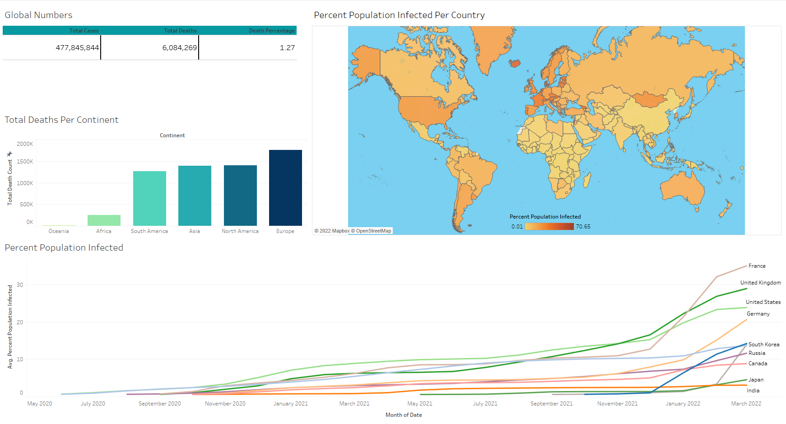

# PortfolioProjects

## View Data
Select * 
FROM `covidproject-345319.CovidVaccines.CovidDeaths` 
ORDER BY 3,4 

## Select Relevant Data 
SELECT location, date, total_cases, new_cases, total_deaths, population  
FROM `covidproject-345319.CovidVaccines.CovidDeaths`  
ORDER BY 1,2

## Looking at the total cases vs total deaths
## Shows falality rate of covid contraction
SELECT location, date, total_cases, total_deaths, (total_deaths/total_cases)*100 as fatality_rate 
FROM `covidproject-345319.CovidVaccines.CovidDeaths` 
~~WHERE location = "United States"~~  
ORDER BY 1,2 

## Total Cases Vs Population
## Shows what percentage of populaton contracted covid
SELECT location, date, total_cases, population, (total_cases/population)*100 as contraction_percentage 
FROM `covidproject-345319.CovidVaccines.CovidDeaths` 
~~WHERE location = 'United States'~~ 
ORDER BY 1,2 

## Countries with highest infection rate compared to Population
SELECT location, MAX(total_cases) as highest_infection_count, population, MAX((total_cases/population))*100 as infection_rate  
FROM `covidproject-345319.CovidVaccines.CovidDeaths` 
GROUP BY location, population 
ORDER BY infection_rate DESC 
 
 
## Countries with highest death count per population
SELECT location, MAX(total_deaths) as total_death_count 
FROM `covidproject-345319.CovidVaccines.CovidDeaths` 
WHERE continent is not null  
GROUP BY location 
ORDER BY total_death_count desc 

## Showing the continents with the highest death count
SELECT continent, MAX(total_deaths) as total_death_count 
FROM `covidproject-345319.CovidVaccines.CovidDeaths` 
WHERE continent is not null  
GROUP BY continent 
ORDER BY total_death_count desc 

## GLOBAL VIEW
SELECT SUM(new_cases) as total_cases, SUM(new_deaths) as total_deaths, SUM(new_deaths)/SUM(new_cases)*100 as fatality_rate 
FROM `covidproject-345319.CovidVaccines.CovidDeaths` 
WHERE continent is not null  
~~GROUP BY date~~ 
ORDER BY 1,2 

## Looking at Total vs Vaccinations
SELECT dea.continent, dea.location, dea.date, dea.population, vac.new_vaccinations
, SUM(Cast(vac.new_vaccinations as int)) OVER (PARTITION BY dea.location ORDER BY dea.location, dea.date) as rolling_people_vaccinated 
FROM `covidproject-345319.CovidVaccines.CovidDeaths` dea 
JOIN `covidproject-345319.CovidVaccines.CovidVaccines` vac 
    ON dea.location = vac.location 
    and dea.date = vac.date 
WHERE dea.continent is not null  
ORDER BY 2,3 

## CTE
WITH popvsvac AS 
( 
SELECT dea.continent, dea.location, dea.date, dea.population, vac.new_vaccinations  
, SUM(Cast(vac.new_vaccinations as int)) OVER (PARTITION BY dea.location ORDER BY dea.location, dea.date) as rolling_people_vaccinated 
FROM `covidproject-345319.CovidVaccines.CovidDeaths` dea 
JOIN `covidproject-345319.CovidVaccines.CovidVaccines` vac 
    ON dea.location = vac.location 
    and dea.date = vac.date 
WHERE dea.continent is not null  
) 
SELECT *, (rolling_people_vaccinated/Population) * 100 
FROM popvsvac 

# Visualizing the Data

## Global Numbers

### SQL Query

SELECT SUM(new_cases) as total_cases, SUM(cast(new_deaths as int)) as total_deaths, SUM(cast(new_deaths as int))/SUM(New_Cases)*100 as DeathPercentage 
FROM `covidproject-345319.CovidVaccines.CovidDeaths` 
WHERE continent is not null  
ORDER by 1,2 

### Visualization

   

## Total Deaths Per Continent

### SQL Query

SELECT location, SUM(cast(new_deaths as int)) as TotalDeathCount 
FROM `covidproject-345319.CovidVaccines.CovidDeaths`  
WHERE continent is null  
and location not in ('World', 'European Union', 'International')  
GROUP BY location  
ORDER BY TotalDeathCount desc  
 
### Visualization

    

## Percentage of Population Infected Per Country

### SQL Query

SELECT Location, Population, MAX(total_cases) as HighestInfectionCount,  Max((total_cases/population))*100 as PercentPopulationInfected  
FROM `covidproject-345319.CovidVaccines.CovidDeaths` 
GROUP by Location, Population 
ORDER by PercentPopulationInfected desc   

 
  
### Visualization

  

    
  
## Percentage of Population Infected
  
### SQL Query

SELECT Location, Population,date, MAX(total_cases) as HighestInfectionCount,  Max((total_cases/population))*100 as PercentPopulationInfected 
FROM `covidproject-345319.CovidVaccines.CovidDeaths` 
GROUP by Location, Population, date 
ORDER by PercentPopulationInfected desc 
 
 

### Visualization
  
   

## Creating the Final Dashboard

  

